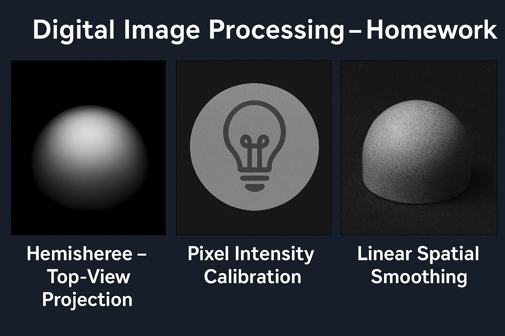

# 📸 Digital Image Processing – Homework 2

  

## 📖 Overview
This repository contains the complete implementation, analysis, and results for **Homework 2** of the *Digital Image Processing* course.  
The exercises integrate **mathematical modeling**, **image generation**, **spatial filtering**, **frequency-domain concepts**, and **multi-modal analysis**.  

---

## 📂 Contents
Each section below corresponds to the homework structure (Questions 2–9).  
All tasks are implemented with **modular, reusable code** and documented for reproducibility.

---

## 2. Hemisphere Light Bulb – Intensity Analysis & Projection

### Problem Summary
We analyze a factory’s production of hemisphere-shaped light bulbs with a specified intensity pattern:
- Shape: Hemisphere of radius $R$
- Intensity:  
  $$I(\rho, \phi, z) = I_{\text{max}} \cdot z \quad\text{where}\quad z = R \cos(\theta)$$
  in spherical coordinates.

### Key Tasks
- **2-a:** Analytical calculation of the mean surface intensity (surface integration, not volume).
- **2-b:** Physical interpretation of the intensity distribution & impact of $I_{\text{max}}$ choice.
- **2-c:** Generate a **512×512** px top-view projection of the ideal hemisphere.
- **2-d:** Mean intensity of the projected circle and relation to 2-a.
- **2-e / 2-f:** Impact of embedding in a square frame (zero padding) on mean intensity.

**Deliverables**:  
✔ Mathematical derivations  
✔ Python/MATLAB scripts  
✔ Generated images & numerical results  

---

## 3. Pixel Intensity Calibration Issues

### Context
A top-down camera captures the hemisphere’s projection. The imaging setup fixes the top point’s distance to the lens at `2R`. Four faulty captures are provided.

### Key Tasks
- **3-a → 3-d:** Identify defects in each given image, apply correction methods from **Section 3.2** of the textbook, and compute corrected mean intensities.
- Compare post-correction mean intensity with the ideal value from **2-f**.

**Techniques Used**:
- Illumination correction  
- Gamma adjustment  
- Intensity normalization  

---

## 4. Watermark Logo Enhancement

### Task
Enhance a barely visible watermark on the hemisphere surface for marketing purposes.

**Approach**:
- Start with **histogram equalization**.
- Improve visibility using **advanced contrast enhancement** beyond naive equalization.

**Deliverables**: Enhanced image with documented algorithm design.

---

## 5. Linear Spatial Smoothing

### Task
Reduce strong noise in captured images.

**Steps**:
- **5-a:** Compare noisy vs. ideal image mean intensities.
- **5-b:** Apply box filters (sizes: 9, 25, 49, 81).
- **5-c:** Compute **Mean Squared Error (MSE)** for each kernel.
- **5-d:** Incrementally vary box filter size from `3×3` to `127×127` (odd numbers only), plot MSE vs. $k$.
- **5-e:** Repeat with Gaussian low-pass filters ($\sigma=5$), compare with box filter.
- **5-f:** 2D MSE analysis over both $k$ and $\sigma$.

**Outputs**:
- Filtered images for each $k$  
- MSE plots  
- Optimal filter parameters  

---

## 6. Separable Kernels

**Objective**: Compare runtime and output quality between:
- 2D Gaussian filtering
- Two-pass separable 1D Gaussian filtering

**Deliverables**:
- Execution time benchmark  
- Quality comparison vs. Section 5 results  

---

## 7. Modality & Multi-Modal QC

### Concept
Visual inspection alone may fail for QC. We integrate **ultrasonic scanning** for structural verification.

**Tasks**:
- **7-a / 7-b:** Discuss shape verification with/without intensity correctness.
- **7-c:** Generate a **512×512** px ideal target ultrasonic map from noisy sensor data.
- **7-d:** Perform full 2D MSE parameter search (as in 5-f) for denoising.

**Techniques Used**:
- Physics-based normalization  
- Gaussian smoothing parameter sweep  

---

## 8. Into the Maps! – High-Pass & High-Boost Filtering

**Given**: Grayscale satellite image.  
**Tasks**:
- **8-a:** Directional high-pass filtering (H, V, Diagonal).
- **8-b:** Sobel, Prewitt, Roberts Cross edge detection.
- **8-c:** Laplacian sharpening.
- **8-d:** High-boost filtering ($A = 1.5$).
- **8-e:** Study kernel size effect on edge/boost performance.

---

## 9. Directional Edge Analysis

**Given**: Three grayscale images.  
**Tasks**:
- **9-a → 9-c:** Apply directional high-pass filtering, compute mean intensities, interpret dominant structures.
- **9-d:** Cross-image comparison of structural patterns.

---

## 🛠 Technologies & Tools
- **Languages**: Python, MATLAB
- **Libraries**: NumPy, OpenCV, Matplotlib, SciPy
- **Concepts**: Spatial filtering, intensity calibration, MSE analysis, Gaussian kernels, histogram equalization

---

## 📂 Folder Details

### `data/`
Contains all raw and prepared datasets, images, and additional input files required to run the tasks.

### `docs/`
Includes relevant documentation, explanations, and any reference material provided or created for the homework.

### `results/`
Stores the generated outputs from running the code — including processed images, plots, and metrics.

### `src/`
Holds all source code for this homework.  
Each question is implemented in separate scripts or Jupyter notebooks, organized for easy navigation.

### `README.md`
The main documentation file describing the project, objectives, and structure.

---

## 📜 Notes
- All code in `src/` is written to be **modular** and **reproducible**.
- Images and data are separated from the code to maintain clarity.
- Results are saved in `results/` for easy comparison and report generation.

---

## 📈 Results Summary
- Derived analytical formulas match numerical integration results.
- Developed a full pipeline for **image generation → calibration → denoising → edge detection**.
- Performed **objective MSE-based filter optimization**.
- Demonstrated runtime benefits of separable kernels.
- Validated **multi-modal QC approach** for robust defect detection.

---

## 📜 License
This repository is for **educational and research purposes** only.  
All images and scripts are subject to the course’s academic integrity policy.
