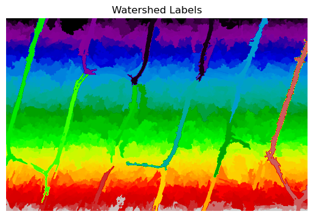

# 📸 Digital Image Processing – Homework 4
<p align="center">
  
</p>

## 📖 Overview
This repository contains the complete implementation, analysis, and results for **Homework 4** of the Digital Image Processing course.  
The exercises focus on **segmentation** by thresholding, edges, and regions, covering both classical algorithms and practical considerations for robust pipelines.

## 📂 Contents
Each section below corresponds to the homework structure (Questions **2–4**).  
All tasks are implemented with modular, reusable code and documented for reproducibility.

---

## 2. Thresholding-Based Segmentation
### Background
Global and adaptive thresholding partition the image by comparing pixel intensities with one or more thresholds. This is widely used in document analysis, medical imaging, and industrial inspection.

### Key Tasks
- **2-a:** Implement **global thresholding by Otsu’s method**; report the threshold value and show the binary result.  
- **2-b:** Apply **adaptive (local) thresholding** with a **15×15** window; compare with the global result.  
- **2-c:** Plot the **histogram** of the original image and **indicate the chosen thresholds** (global Otsu and representative local thresholds).  
- **2-d:** **Discuss scenarios** where adaptive thresholding outperforms global thresholding (non-uniform illumination, vignetting, shadows, textured backgrounds, gradual shading, etc.).

### Deliverables
- ✔ Otsu threshold value and binary mask
- ✔ Adaptive (15×15) thresholding result
- ✔ Overlaid histogram with global & local thresholds
- ✔ Short discussion on global vs. adaptive thresholding

> **Notes:** Otsu’s method maximizes inter-class variance; local methods handle illumination gradients but may be sensitive to window size and noise. Consider pre-smoothing (e.g., Gaussian blur) before local thresholding when needed.

---

## 3. Edge-Based Segmentation
### Background
Edge-based methods locate object boundaries via intensity discontinuities. After edge detection, **linking and thresholding** form closed contours useful in applications like road extraction and object tracking.

### Key Tasks
- **3-a:** Detect edges using the **Canny operator** with appropriate **low/high hysteresis thresholds** (justify your choice).  
- **3-b:** Perform **non-maximum suppression** and thresholding to obtain a **clean binary edge map** (verify thin, well-localized edges).  
- **3-c:** Apply the **Hough transform** to extract **straight lines** from the edge map; **overlay** detected lines on the original image.  
- **3-d:** **Explain** how **noise and threshold choices** affect the completeness and continuity of the detected contours (missed weak edges vs. spurious edges).

### Deliverables
- ✔ Canny edge map with selected thresholds
- ✔ Clean binary edge map after NMS & hysteresis
- ✔ Hough line detections overlaid on the original image
- ✔ Discussion of noise/threshold effects on contour completeness

> **Tips:** Use smoothing (Gaussian) before Canny; tune high/low thresholds as a ratio (e.g., 2–3×) and validate with precision/recall trade-offs. For Hough, set accumulator resolution and vote thresholds to balance detections vs. false positives.

---

## 4. Region-Based Segmentation
### Background
Region-based methods group pixels by similarity (intensity/texture). Typical techniques include **region growing**, **splitting–merging**, and **watershed**. They are common in remote sensing and biomedical imaging.

### Key Tasks
- **4-a:** Implement **region growing** from **manually chosen seed points** (≥ 3). Show **grown regions overlaid** on the original image.  
- **4-b:** Apply the **watershed transform** after computing the **gradient magnitude** (e.g., Sobel/Scharr). Consider **markers** (foreground/background) to mitigate over-segmentation.  
- **4-c:** **Compare** region growing vs. watershed. Which one **better separates touching cells** (or adjacent objects) under your settings?  
- **4-d:** **Discuss** how **pre-/post-processing** (e.g., smoothing, morphological operations, connected-component filtering) improves segmentation quality and reduces over-/under-segmentation.

### Deliverables
- ✔ Region growing overlays (with seed locations)
- ✔ Watershed segmentation maps
- ✔ Comparative analysis (touching objects, leakage, over-segmentation)
- ✔ Suggested pre-/post-processing steps and their impact

> **Hints:** For watershed on touching objects, distance-transform–based markers and morphological opening/closing often help. For region growing, choose a robust similarity threshold (intensity or texture) and consider stopping criteria.

---

## 🛠 Technologies & Tools
**Languages:** Python, MATLAB  
**Libraries:** NumPy, OpenCV, SciPy, scikit-image, Matplotlib  
**Concepts:** Otsu thresholding, local/adaptive thresholding, Canny, NMS & hysteresis, Hough transform, gradient magnitude, watershed, region growing, morphological ops

---

## 📂 Folder Details
```
data/       # Raw and prepared images; any input assets
docs/       # Explanations, references, and auxiliary notes
results/    # Saved outputs: masks, overlays, plots, metrics
src/        # Source code (scripts/notebooks) for Q2–Q4
README.md   # This documentation
```

---


## 📜 License
This repository is for **educational and research purposes** only.  
All images and scripts are subject to the course’s academic integrity policy.
